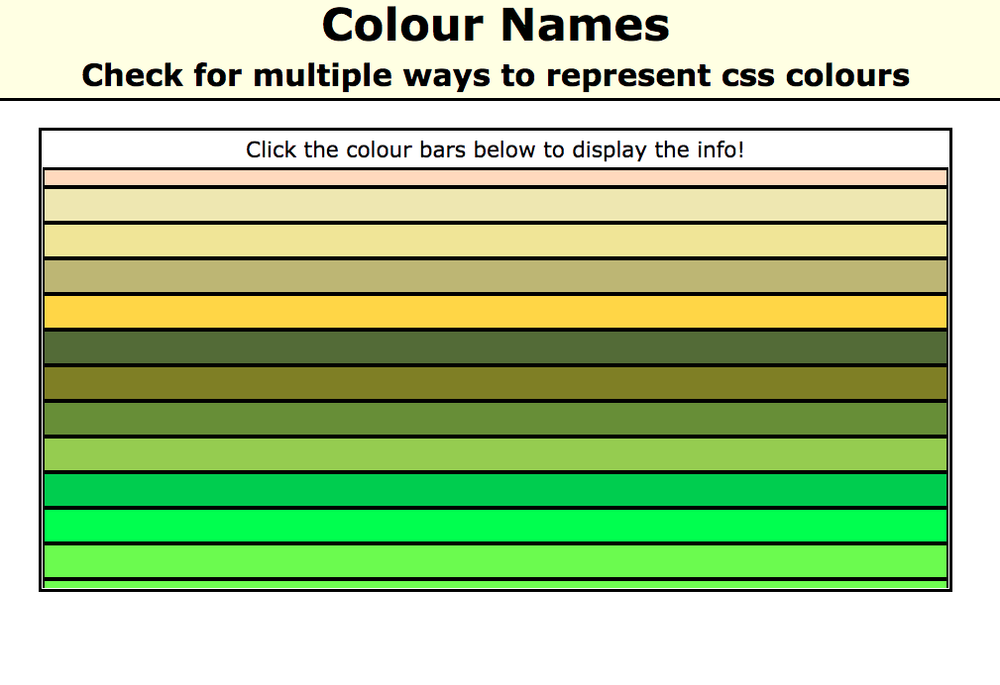
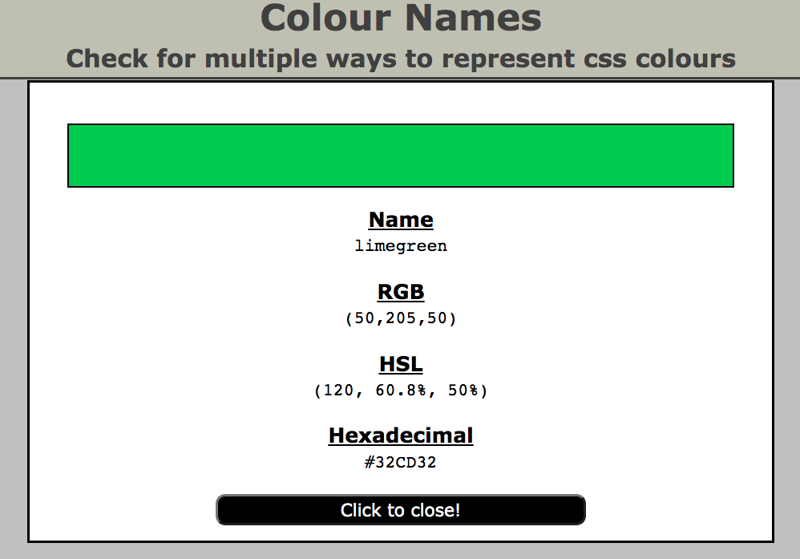
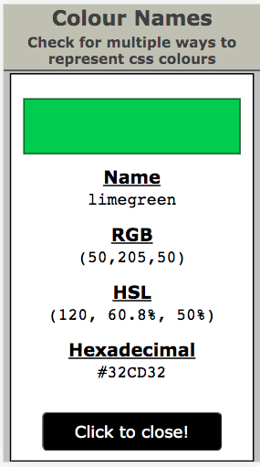

# Colour Names App.

An app that displays the various ways to represent a colour when using CSS.

## Built with:
* The MERN stack
* CSS
---
## Seed data.

Add the documents required with the below terminal command.

```
npm run seeds
```
---
## App Image: Starter Image.

---
## App Image: In-use Image.

---
## App Image: Responsive Example.

